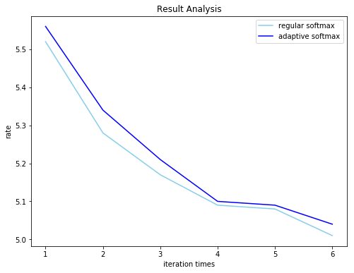
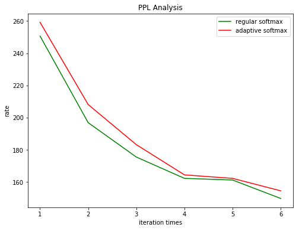

# Word-level language modeling RNN Using adaptive softmax

By default you need download the preprocessed wikitext-2 dataset [wikitext-2.zip](#jump) and 
put the zip file under data folder. 

Of course you can use your own text dataset as well.
```bash 
cd data 
unzip wikitext-2.zip
cd ..
python main.py --epochs 6   # Train a LSTM on Wikitext-2 with CUDA
python main.py --epochs 6 --model LSTM_adaptive    # Train a LSTM with adaptive softmax on Wikitext-2 with CUDA
```
You may add `--cuda` option to accelerate the training process if you have a gpu.

## Result:
### For regular softmax:
#### Train:
| epoch | epoch time | valid loss | valid ppl |
| - | - | - | - |
| end of epoch   1 | time: 48.67s | valid loss  5.52 | valid ppl   250.68
| end of epoch   2 | time: 48.61s | valid loss  5.28 | valid ppl   196.87
| end of epoch   3 | time: 48.66s | valid loss  5.17 | valid ppl   175.51
| end of epoch   4 | time: 48.90s | valid loss  5.09 | valid ppl   162.27
| end of epoch   5 | time: 49.76s | valid loss  5.08 | valid ppl   161.23
| end of epoch   6 | time: 49.63s | valid loss  5.01 | valid ppl   149.77

#### Test:

test loss  4.94s  
test ppl  139.35

all Time_cost: 296.55s


### For adaptive softmax:
#### Train:
| epoch | epoch time | valid loss | valid ppl |
| - | - | - | - |
| end of epoch   1 | time: 28.68s | valid loss  5.56 | valid ppl   259.24
| end of epoch   2 | time: 30.67s | valid loss  5.34 | valid ppl   208.12
| end of epoch   3 | time: 30.43s | valid loss  5.21 | valid ppl   183.21
| end of epoch   4 | time: 30.32s | valid loss  5.10 | valid ppl   164.43
| end of epoch   5 | time: 28.89s | valid loss  5.09 | valid ppl   162.26
| end of epoch   6 | time: 29.30s | valid loss  5.04 | valid ppl   154.52

#### Test:

test loss  4.97s  
test ppl  143.32

all Time_cost: 179.856s

### Loss comparison


### PPL comparison



## <span id="jump">How to get wikitext-2.zip</span>
由于文件太大，所以放到网盘中了

欢迎关注公众号：机器学习爱好者

或者扫码：


关注后回复 adaptive 就可以获取下载地址啦